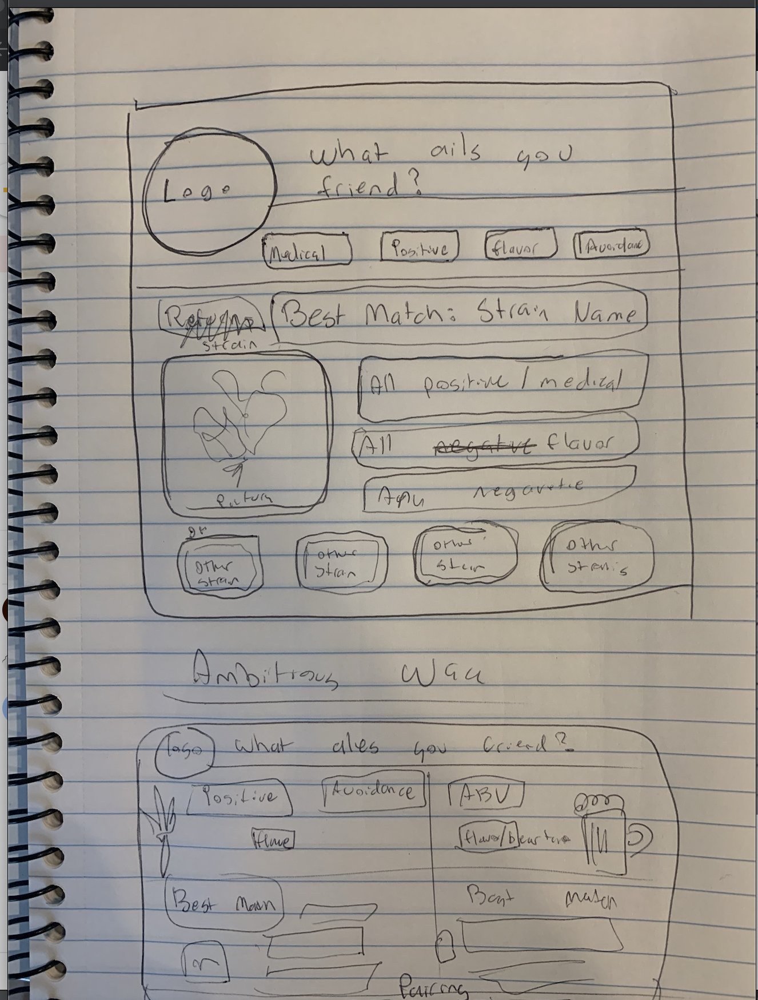

What ails you friend? - Application for choosing the right strain of weed and beer combination for the night. Plenty of information

API : http://strains.evanbusse.com/index.html

The application will have multiple parameters for user to choose from. Debating whether this will be input based or if it will be a drop down menu with actual data provided by the API.

Four parameters will be: 

1. Indica/Hybrid/Sativa/All
2. What is bothering you? 
3. What kind of feeling are you looking for?
4. Flavor you are looking for?

Once user inputs what they are looking for the API will be called and looped through. Returning the strains the fit what the user is looking for. The user can then click on strains and explore others that are simiilar. Users can opt out of any of the search parameters to deliver more results.

The one that fits the paramets best will be displayed on the screen large on the top with all of its assests listed. Ideally this API will provide pictures but I cannot fully access it at the moment so if it does not then I will have to have a bunch of stock images that will be randomly appended to the picture element of returned information.

At the bottom will be the rest of the strains that also fit what the user is looking for most closely. Will probably have to max the search out around 25. 

Ideally I would like to make a website that pairs strains with beer. Called "What ales you?" that pairs the parameters above for the weed and then a separate search with flavor, type of beer and ABV. Users can do searchs separately or they can opt to have them paired. Pairing would be done based off how "faded" they were trying to get (ABV and strength) or flavor/type of beer that I would need to set parameters out for best matches.

Design will be interative and ideally full of CSS animations and such.

Layout will be as follows: 

///////// Video Game Tree

API: https://rawg.io/apidocs

This application allows for someone to search a video game database for a game that they input. The application returns video games that match the search query with other information included. This will range from the reviews, screenshots, type of game, whether its gory, to clips and other games related. The user should be able to click on screenshots of the other games to bring them to the page and bring up new batch of games and such.

